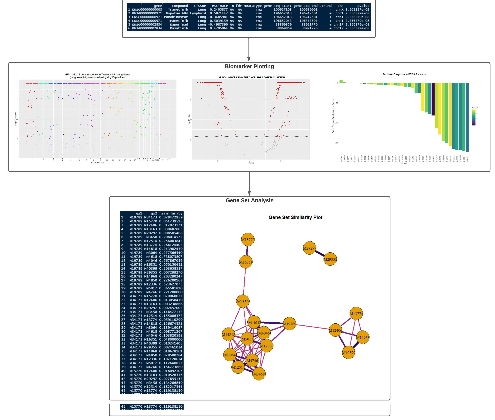

<!-- README.md is generated from README.Rmd. Please edit that file -->

```{r, include = FALSE}
knitr::opts_chunk$set(
  collapse = TRUE,
  comment = "#>",
  fig.path = "man/figures/README-",
  out.width = "100%"
)
```

# PGxVision

<!-- badges: start -->
<!-- badges: end -->

## Description

PGxVision (PharmacoGenomic Vision & Interpretation) helps identify and 
visualize RNA-based cancer biomarkers for drug response. This package is 
intended to be used in conjunction with the Roche-PharmacoGx pipeline. 
PGxVision is intended to guide cancer treatment decisions in molecular 
tumour boards.

``` r
R version 4.1.1 (2021-08-10)
Platform: x86_64-w64-mingw32/x64 (64-bit)
Running under: Windows 10 x64 (build 19043)
```

## Installation

To download the package:

``` r
require("devtools")
devtools::install_github("EvgeniyaGorobets/PGxVision", build_vignettes=TRUE)
library("PGxVision")
```

To build the shinyapp: 
```r
roxygen2::roxygenise();
devtools::install()
```

To run the shinyApp:
``` r
runPGxVision()
```

i.e., 
```r
PGxVision::runPGxVision()
```

To build the documentation for the project, make sure to edit the README.Rmd file instead of README.md. Afterwards, you must run the following command in the home directory:

``` r
devtools::build_readme(path=".")
```

### Dependencies

Below are relevant dependencies that you will need to install in order to use PGxVision

```r
# CORE DEPENDENCIES
roxygen2
devtools
shiny
shinyjs        

# ADDITIONAL DEPENDENCIES
plotly         # Data Visualization
ggplot2        # Data Visualization
magrittr       # A Forward-Pipe Operator for R
jsonlite       # Read and Write JSON in R
httr           # HTTP Requests
data.table     # Data Table Processing 
promises       # Asynchronous Functionality
future         # Asynchronous Functionality
shinyalert     # Provides Alert UI
shinybusy      # Provides "Busy" UI Functionality and Animations
msigdbr        # Access to MSig Database for Gene Sets1
GSVA           # Single Sample GSEA. NOTE: This is a BHKLab fork of GSVA. View below.
DT             # Data Table Processing 
```

To fork the BHKLab version of GSVA (which contains a patch to a bug in the SSGSEA functionality of the package), install GSVA like so:
```r
devtools::install_github("bhklab/GSVA")
```

### Recommended Readings

The following are recommended readings to hit the ground running when working on this project
1. RNA-based Drug Response Prediction Part 1 - Roche [Internal Lab Document]
2. RNA-based Drug Response Prediction Part 1 - Report [Internal Lab Document]
3. Smirnov, P. et al. PharmacoGx: an R package for analysis of large pharmacogenomic datasets. Bioinformatics 32, 1244–1246 (2016).
4. Haibe-Kains, B. et al. Inconsistency in large pharmacogenomic studies. Nature 504, 389–393 (2013).
5. Safikhani, Z. et al. Revisiting inconsistency in large pharmacogenomic studies. F1000Res 5, 2333 (2017).
6. Seo, H. et al. SYNERGxDB: an integrative pharmacogenomic portal to identify synergistic drug combinations for precision oncology. Nucleic Acids Research 48, W494–W501 (2020).
7. Feizi, N. et al. PharmacoDB 2.0: improving scalability and transparency of in vitro pharmacogenomics analysis. Nucleic Acids Research 50, D1348–D1357 (2022).
8. Nair, S. K. et al. ToxicoDB: an integrated database to mine and visualize large-scale toxicogenomic datasets. Nucleic Acids Research 48, W455–W462 (2020).
9. Adam, G. et al. Machine learning approaches to drug response prediction: challenges and recent progress. npj Precis. Onc. 4, 1–10 (2020).


## Overview

``` r
ls("package:PGxVision")
data(package = "PGxVision")
browseVignettes("PGxVision")
```

`PGxVision` contains nine functions and four sample data sets. Of the nine 
functions, one is to run the Shiny app for this package, three are plotting 
functions for visualizing drug sensitivity data, and five are gene set analysis 
functions that help provide biological context for genes of interest.

An overview of the package is illustrated below. 



### Biomarker Plotting

The _buildManhattanPlot_ function visualizes gene response to a certain drugs 
across the entire human genome. The x-axis represents the full human genome and 
is labeled by chromosome, and the y-axis can either plot the drug sensitivity 
or the p-value/fdr/significance of the drug sensitivity statistic. As is the 
standard for Manhattan plots, data points are colored according to what 
chromosome they belong to.

The _buildVolcanoPlot_ function lets you simultaneously visualize the drug 
sensitivity and the p-value/significance of the sensitivity statistic. As is 
standard for volcano plots, points that are statistically insignificant are 
grayed out. 

The _buildWaterfallPlot_ function plots drug sensitivity (or other similar 
metrics) across a range of tumours or a range of drugs. The waterfall plot will 
order results according to the y-axis, so users can quickly identify the most 
and least sensitive tumour-drug combinations.

You can learn more about how to use these plotting functions in the Plotting 
Biomarkers section of the Visualizing and Interpreting Biomarkers vignette.

### Gene Set Analysis

The gene set analysis in this package is broken down into four steps:

1. _getGeneSets_: Given an ENSEMBL gene ID, find all gene sets that contain 
   that gene and return information about those gene sets. Users can examine 
   different types of gene sets, such as those based on biological pathways, 
   cellular components, molecular function, etc.
2. _expandGeneSets_: Using the gene set IDs retrieved in _getGeneSets_, get all 
   other genes in those gene sets.
3. _computeGeneSetSimilarity_: Using the fully expanded gene sets from 
   _expandGeneSets_, compute the overlap between the gene sets. All gene sets 
   will at least contain the initial query gene, so pairwise overlap will be 
   non-zero. Currently, the package only supports similarity metrics based on 
   the proportion of intersecting genes to total genes.
4. _buildNetworkPlot_: Plot the gene sets that were retrieved in _getGeneSets_, 
   using their similarity scores from _computeGeneSetSimilarity_ as edge 
   weights. Gene sets that have high overlap will be in closer proximity and 
   will have thicker and darker edges between them.
  
In addition to these four functions, the _geneSetAnalysis_ function is provided 
to run the first three steps of the above pipeline. You can learn more about 
how to use these gene set analysis functions in the Gene Set Analysis section 
of the Visualizing and Interpreting Biomarkers vignette.

### Single Sample Get Set Enrichment Analysis (ssGSEA)

The _performSSGSEA_ function allows you to provide a dataframe containing a 
sample's mRNA expression along with a JSON file containing the gene sets you
wish to analyze. Example genesets are provided in the extdata/gsets directory, 
and contain the MSigDB Hallmark gene sets. Gene IDs must be standardized 
between the sample's expression dataframe and the ones used in the gene set 
JSON file.


### Shiny Dashboard

The _runPGxVision_ lets you perform the functions described above by interacting 
with UI elements. The dashboard layout of the app lets you see multiple plots 
side by side, to facilitate analysis. Additionally, the Shiny app lets you 
interact with the plots (hovering over and selecting points), making it easier 
to extract useful information.

The screenshots below illustrate what the main features and layout of the app. 
It is divided into two tabs: "Biomarkers", which lets you look at gene-level 
cell-line drug sensitivity data, and "Treatment Response", which lets you 
examine and compare treatment responses of different tumours and compounds.

<!-- The code for placing images inline was taken from jdlong's comment on 
 a post in RStudio Community: 
 jdlong. (2018). How to stack two images horizontally in R Markdown. RStudio 
 Community. 
 https://community.rstudio.com/t/how-to-stack-two-images-horizontally-in-r-markdown/18941 -->
```{r image_grobs, fig.show = "hold", out.width = "33%", echo=FALSE}

knitr::include_graphics("./inst/extdata/figures/app-1.png")
knitr::include_graphics("./inst/extdata/figures/app-2.png")
knitr::include_graphics("./inst/extdata/figures/app-3.png")

```

### Sample Data

The _BRCA.PDXE.paxlitaxel.response_ data set is a `data.frame` with treatment 
vs. control angle data from BRCA PDXs (patient-derived xenographs). It is used 
in the _buildWaterfallPlot_ example and was retrieved from the `Xeva` package.

The _Biomarkers_ data set is a `data.frame` with drug sensitivity/response data 
in various experiments involving cancer cell lines (an experiment is a unique 
combination of a drug, tissue, and molecular data type). This data set 
also contains the p-values for the drug sensitivity statistics. It is used in 
the _buildManhattanPlot_ and _buildVolcanoPlot_ examples and was retrieved from 
PharmacoDb.

The _GRCh38.p13.Assembly_ data set is a `data.frame` containing basic 
information about the GRCh38.p13 genome assembly. Most notably, it includes the 
names and lengths of all the chromosomes. It is used in the 
_buildManhattanPlot_ function and was retrieved from Gencode.

The _TestGeneSets_ data set is a `data.frame` containing 10 different gene sets 
and all their constituent genes. This data set represents all the gene sets 
in the "GO::CC" (GO cellular compartment) category that gene ENSG00000012124 is 
a part of. It is used for testing and was retrieved from MSigDb.


## Contributions

The author of the package is Evgeniya Gorobets.

`data.table` is used to transform `data.frame`s into `data.table`s in some 
plotting and gene set analysis functions (_buildVolcanoPlot, buildManhattanPlot,
queryGene, expandGeneSets, computeGeneSetSimilarity_). The `data.table` 
vignettes were used to create cleaner syntax and optimize table manipulation. 

`ggplot2` is used to create non-network plots (_buildVolcanoPlot, 
buildManhattanPlot, buildWaterfallPlot_), and `viwNetwork` is used to create 
network plots (_buildNetworkPlot_). `ggprism` is used to enhance the axes on the 
Manhattan plot (_buildManhattanPlot_). `viridis` is used to enhance the colors 
on the network plot (_buildNetworkPlot_).

`checkmate` is used to succinctly check user input in all functions.

`msigdbr` is used to query the MSigDb in gene set analysis functions 
(_queryGene, expandGeneSets_).

`shiny`, `shinydashboard`, and `shinybusy` are used to create the Shiny app and 
generate UI elements in the app. `plotly` is used to add interactivity to 
ggplots that are rendered in the Shiny app. `visNetwork` is used to add 
interactivity to visNetwork graphs that are generated in the Shiny app. 

`magrittr` is used to pipe between functions.

## References

### Package References

These references describe any and all packages used in PGxVision.

Almende B.V., Thieurmel, B., & Robert, T. (2021). visNetwork: Network 
  Visualization using 'vis.js' Library. R package version 2.1.0. 
  https://CRAN.R-project.org/package=visNetwork

Bache, S. M., and Wickham, H. (2020). magrittr: A Forward-Pipe Operator for R. 
  R package version 2.0.1. https://CRAN.R-project.org/package=magrittr
  
Chang, W. and Borges Ribeiro, B. (2021). shinydashboard: Create 
  Dashboards with 'Shiny'. R package version 0.7.2.
  https://CRAN.R-project.org/package=shinydashboard

Chang, W., Cheng, J., Allaire, J., Sievert, C., Schloerke, B., Xie, Y., Allen, 
  J., McPherson, J., Dipert, A., and Borges, B. (2021). shiny: Web Application 
  Framework for R. R package version 1.7.1. 
  https://CRAN.R-project.org/package=shiny

Dawson, C. (2021). ggprism: A 'ggplot2' Extension Inspired by 'GraphPad Prism'. 
  R package version 1.0.3. https://CRAN.R-project.org/package=ggprism
  
Dolgalev, I. (2021). msigdbr: MSigDB Gene Sets for Multiple Organisms in a Tidy 
  Data Format. R package version 7.4.1. 
  https://CRAN.R-project.org/package=msigdbr

Dowle, M., and Srinivasan, A. (2021). data.table: Extension of `data.frame`. 
  R package version 1.14.2. https://CRAN.R-project.org/package=data.table.
  
Garnier, S., Ross, N., Rudis, R., Camargo, A. P., Sciaini, M., and Scherer, C.
  (2021). Rvision - Colorblind-Friendly Color Maps for R. R package version 
  0.6.2.

Lang, M. (2017). “checkmate: Fast Argument Checks for Defensive R Programming.” 
  _The R Journal 9_(1), 437-445. 
  https://journal.r-project.org/archive/2017/RJ-2017-028/index.html.
  
Meyer, F. and Perrier, V. (2020). shinybusy: Busy Indicator for 'Shiny' 
  Applications. R package version 0.2.2. 
  https://CRAN.R-project.org/package=shinybusy
  
R Core Team. (2021). R: A language and environment for statistical computing. R
   Foundation for Statistical Computing, Vienna, Austria. 
   https://www.R-project.org/.
   
Sievert, C. (2020). _Interactive Web-Based Data Visualization with R, plotly, 
  and shiny_. Chapman and Hall/CRC.
   
Wickham, H. (2016). ggplot2: Elegant Graphics for Data Analysis. 
  Springer-Verlag New York. https://ggplot2.tidyverse.org.
  
  
### Data References

These references indicate the source for all datasets available in PGxVision.

Feizi, N., Nair, S. K., Smirnov, P., Beri, G., Eeles, C., Esfahani, P. N., … 
  Haibe-Kains, B. (2021). PharmacoDB 2.0: Improving scalability and 
  transparency of in vitro pharmacogenomics analysis. _bioRxiv._ 
  doi:10.1101/2021.09.21.461211
  
Frankish, A., Diekhans, M., Ferreira, A. M., Johnson, R., Jungreis, I. 
  Loveland, J., Mudge, J. M., Sisu, C., Wright, J., Armstrong, J., Barnes, I., 
  Berry, A., Bignell, A., Carbonell Sala, S., Chrast, J., Cunningham, F., Di 
  Domenico, T., Donaldson, S., Fiddes, I. T., García Girón, C., … Flicek, P. 
  (2019). GENCODE reference annotation for the human and mouse genomes. 
  _Nucleic acids research, 47_(D1), D766–D773. 
  https://doi.org/10.1093/nar/gky955

Mer A, Haibe-Kains B (2021). Xeva: Analysis of patient-derived xenograft (PDX) 
  data. R package version 1.10.0.

Subramanian, A., Tamayo, P., Mootha, V. K., Mukherjee, S., Ebert, B. L., 
  Gillette, M. A., … Mesirov, J. P. (2005). Gene set enrichment analysis: 
  A knowledge-based approach for interpreting genome-wide expression profiles. 
  _Proceedings of the National Academy of Sciences, 102_(43), 15545–15550. 
  doi:10.1073/pnas.0506580102
  
### Code References

These references indicate the source for any code in PGxVision that was taken 
directly from a website (not including documentation & vignettes for packages).

jdlong. (2018). How to stack two images horizontally in R Markdown. _RStudio 
 Community._ 
 https://community.rstudio.com/t/how-to-stack-two-images-horizontally-in-r-markdown/18941
 
Perry & YakovL. (2017). Stop vis.js physics after nodes load but allow 
  drag-able nodes. _StackOverflow._ 
  https://stackoverflow.com/questions/32403578/stop-vis-js-physics-after-nodes-load-but-allow-drag-able-nodes


## Acknowledgements

This package was developed as part of an assessment for 2021 BCB410H: 
Applied Bioinformatics, University of Toronto, Toronto, CANADA.
